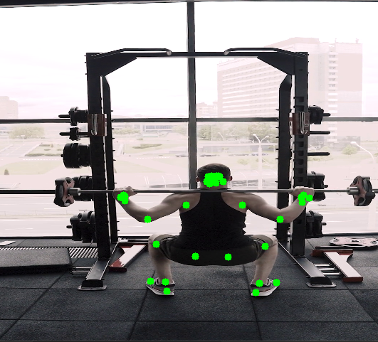

# 🏋️Exercise-Form-Analyzer-Computer Vision
A Flask-based REST API that accepts a short video (≤ 50MB), performs **2D pose estimation**, analyzes **squats** and **pushups**, and returns:

- JSON summary
- Downloadable PDF report with graphs and annotated frames

---

##  Project Structure
```
/
├── api/ # Flask app
├── analysis/ # FSM logic for squats & pushups
├── pose/ # Pose estimation & smoothing
├── reports/ # PDF & CSV report generation
├── demo/ # Example videos
├── tests/ # Unit and integration tests
├── Dockerfile # Docker container setup
├── requirements.txt # Python dependencies
└── README.md # This file
```

---

##  How It Works

### 1. Pose Estimation
- Uses **MediaPipe BlazePose**: lightweight, accurate 2D landmark model
- Extracts 33 body keypoints per frame

### 2. Keypoint Smoothing
- Applies **Exponential Moving Average (EMA)** to each keypoint to reduce jitter
  - `alpha = 0.5`: balances responsiveness with stability
    
### 3. Repetition Detection (FSM)
- Squat: tracks angle between **hip–knee–ankle**
- Pushup: tracks **shoulder–elbow–wrist**
<p align="center">
  
</p>

### 4. Form Checks
| Exercise | Rule | Description |
|----------|------|-------------|
| Squat | `angle < 100°` | Detects descent |
|       | `angle > 160°` | Detects ascent |
|       | `depth > 100°` | Flags `INSUFFICIENT_DEPTH` |
|       | `knee_x - ankle_x > 0.2` | Flags `KNEE_OVER_TOE` |
| Pushup | `elbow < 90°` → down<br>`elbow > 160°` → up | FSM |
|       | `body alignment ≠ 180 ± 15°` | Flags `BODY_LINE_BREAK` |
|       | `elbow angle < 60°` | Flags `ELBOW_FLARE` |

>  FSM (Finite State Machine) approach ensures robust rep counting in noisy videos.

---

##  Setup Instructions

###  Option 1: Run Locally (Python 3.11)
```bash
git clone https://github.com/asmaaelabasy22/exercise-analyzer.git
cd exercise-analyzer
python -m venv venv
venv\Scripts\activate  # or source venv/bin/activate

pip install -r requirements.txt
python -m api.app

```
###  Option 2: Run with Docker
```
docker build -t exercise-analyzer .
docker run -p 5000:5000 exercise-analyzer
```
## API Usage
### POST /analyze
- Accepts: multipart/form-data with a video file (≤ 50MB)

Example curl:
``` curl -X POST http://127.0.0.1:5000/analyze \
     -F video=@demo/squat.mp4
```

Example json:
```{
  "video_id": "abc-123...",
  "summary": {
    "squats": {
      "total_reps": 10,
      "good_form_reps": 8,
      "common_issues": ["INSUFFICIENT_DEPTH"]
    },
    "pushups": {
      "total_reps": 6,
      "good_form_reps": 4,
      "common_issues": ["BODY_LINE_BREAK"]
    }
  },
  "frame_data": [...],
  "pdf_url": "/report/abc-123..."
}
```

### GET /report/<video_id>

Downloads the generated PDF report with:

- Summary table
- Angle vs frame plots
- Good/bad rep bar chart
- Sample pose-annotated frames

## Testing

### Unit Tests: These test the core logic of the application:

```bash
pytest tests/test_pose_estimator.py
pytest tests/test_angles.py
pytest tests/test_analyzer.py
pytest tests/test_report_generator.py
```
Each test verifies:
-
- Correct keypoint smoothing
- Angle calculations (e.g., elbow/knee)
- FSM transitions and rep boundaries
- Form check conditions
  
Integration Test
```bash
pytest tests/test_api.py
```

### Justification of Algorithms

| Component                | Reasoning                                                 |
| ------------------------ | --------------------------------------------------------- |
| **MediaPipe BlazePose**  | Fast, accurate 2D keypoints, works on CPU                 |
| **EMA Smoothing**        | Reduces landmark jitter; α = 0.5 is empirically effective |
| **FSM Repetition Logic** | Avoids false rep counts vs. simple thresholding           |
| **Form Rules**           | Based on joint biomechanics and posture heuristics        |
| **Angle Thresholds**     | Tuned on real exercise clips for generalizability         |

## 📁 Output Location

All generated files are saved to:

```
/reports/
├── {video_id}.pdf      # Visual analysis report
├── results.csv         # Frame-by-frame log of angles and flags
└── summary.json        # Aggregated statistics
```

### Author
Built by Asmaa El Abasy as part of a Computer Vision Engineer assessment challenge.
